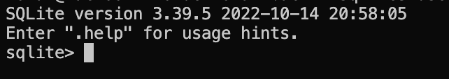

## Ambientar en Local
-  Activar entorno virtual
    - Mac 
     ```bash 
        source venv/bin/activate
    ```
    - Windows 
     ```bash 
        source venv/bin/activate
    ```
    esto deberia mostrar algo como (venv) en la terminal

## Entrar a base de datos SQLite
- Ingresar con el siguiente comando
    ```bash 
    sqlite3 users.db
    ```
    al ingresar a la DB se deberia mostrar lo siguiente


- Ver las base de datos usar el siguiente comando
    ```bash 
    .databases
    ```
- Ver las tablas usar el siguiente comando
    ```bash 
    .tables
    ```


## Levantar back

- `pip3 install -r requirements.txt`: Efectua la instalación de todas las dependencias del archivo requirement.txt
- `uvicorn main:app --reload`: Levanta el servidor de back.