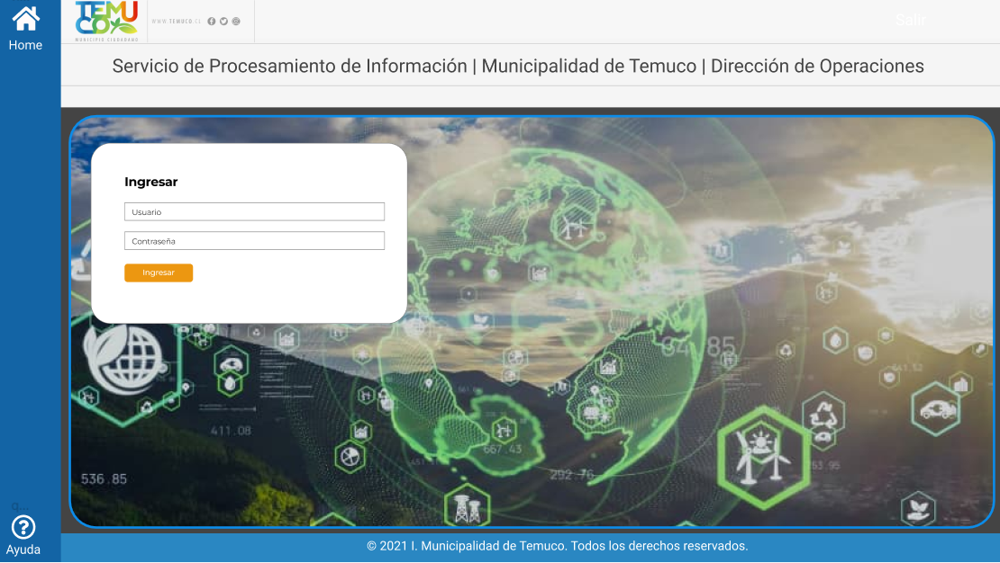

# PROYECTO DE PROCESAMIENTO

- Back-End Desarrollado en Fast-Api
- Front-End Desarrollado en Angular

## Levantar front

- `npm install`: Efectua la instalación de todas las dependencias del archivo package.json
- `ng serve`: Levantar servidor de front 

## Levantar back

- `pip install requirement.txt`: Efectua la instalación de todas las dependencias del archivo requirement.txt
- `uvicorn main:app --reload`: Levanta el servidor de back.

## Mock up del proyecto

<figure>     
         
    <figcaption>Flujo 1. Mock up inicio de sesión.</figcaption> 
</figure>

## Generar componentes en front
- `ng generate component sidebar`: Genera un componente en front llamado sidebar.